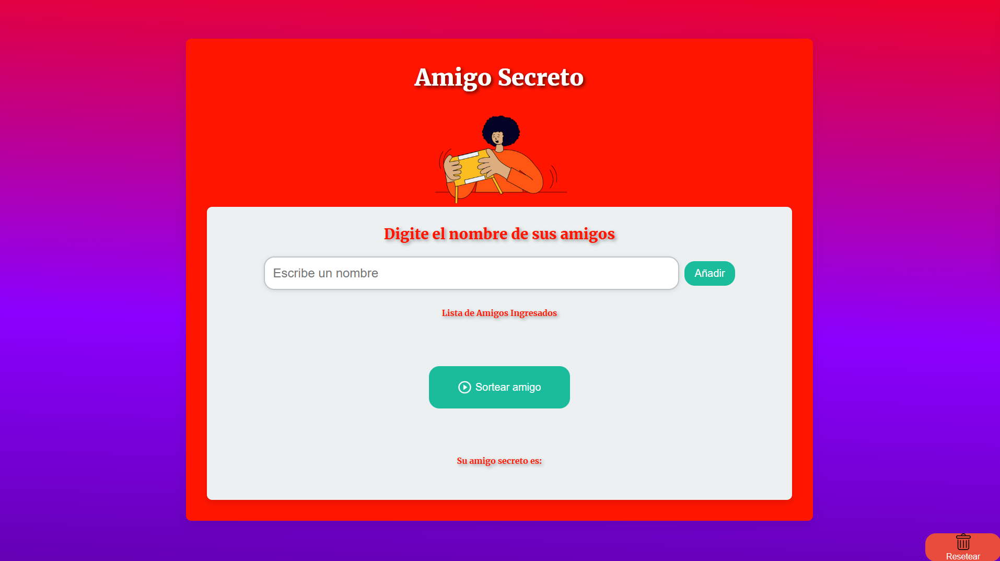

# Challenge Amigo Secreto 🎁🎉

## Descripción ✨
**Amigo Secreto** es una aplicación web que facilita la organización de un sorteo entre un grupo de personas. Permite ingresar los nombres de los participantes, realizar un sorteo aleatorio y visualizar los resultados de manera inmediata.

El proyecto está desarrollado con **HTML**, **CSS** y **JavaScript**, ofreciendo una interfaz atractiva y completamente adaptable a distintos dispositivos.

## Funcionalidades 🚀
- **Agregar amigos**: Los usuarios pueden agregar sus nombres a la lista de amigos utilizando campos de texto.
- **Sorteo aleatorio**: Realiza el sorteo de amigo secreto con solo hacer clic en el botón de **Sortear**. Los participantes serán asignados aleatoriamente a otro.
- **Resetear el sorteo**: Puedes reiniciar la lista y empezar de nuevo en cualquier momento usando el botón **Reset**.
- **Interactividad**: Botones que cambian de color al pasar el cursor por encima, animaciones suaves y efectos visuales para una experiencia de usuario atractiva.
- **Estilos dinámicos**: La interfaz cuenta con un fondo animado que cambia de colores a lo largo del tiempo y textos con efectos de colores arcoíris.
- **Totalmente responsivo**: El diseño es completamente adaptativo a diferentes tamaños de pantalla (móviles, tabletas y escritorios).

## Tecnologías utilizadas 🛠️
- **HTML5**: Estructura semántica y organización del contenido.
- **CSS3**: Estilos modernos, animaciones, y diseño responsivo.
  - **Flexbox y Grid**: Para la disposición flexible y adaptativa de los elementos en la página.
  - **Animaciones CSS**: Efectos de fondo animado y texto arcoíris.
- **JavaScript**: Lógica para gestionar la lista de amigos y el sorteo aleatorio.
- **Font Awesome**: Iconos utilizados para los botones.

## Instalación 🔧
### 1. Clona el repositorio:
```bash
git clone https://github.com/danieibazgc/AmigoSecreto.git
```

### 2. Ejecuta la aplicación:
Abre el archivo `index.html` en tu navegador para interactuar con la aplicación.

## ¿Cómo usar la aplicación? 📝
1. **Añadir nombres**: Introduce los nombres de los participantes y presiona el botón **Agregar**.
2. **Iniciar sorteo**: Al hacer clic en **Sortear**, el sistema asignará un amigo secreto de manera aleatoria.
3. **Visualizar resultados**: Se mostrarán los emparejamientos en pantalla.
4. **Reiniciar**: Si deseas realizar un nuevo sorteo, presiona el botón **Reset** para empezar desde cero.

## Capturas de pantalla 📸


## Contribuciones 🤝
Si tienes sugerencias o encuentras errores, puedes contribuir de las siguientes maneras:
- **Abrir un issue** para reportar problemas o proponer mejoras.
- **Enviar un pull request** con tus modificaciones.

## Contacto 🌐
Si quieres saber más sobre el proyecto o colaborar, puedes encontrarme en:
**Desarrollador**: Daniel Ibañez
**GitHub**: **[danieibazgc](https://github.com/danieibazgc)**
**Instagram**: **[Instagram](https://www.instagram.com/danieibazgc/)**
**Correo**: **[LinkedIn](https://www.linkedin.com/in/danieibazgc/)**
